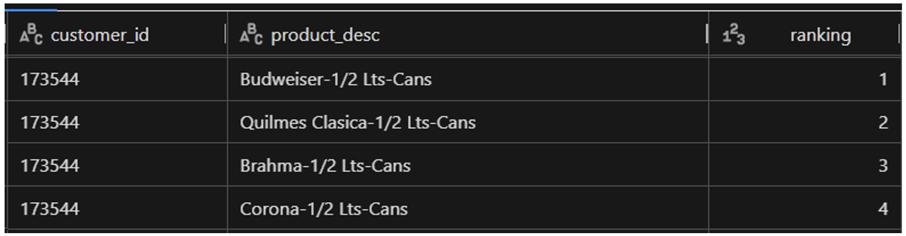
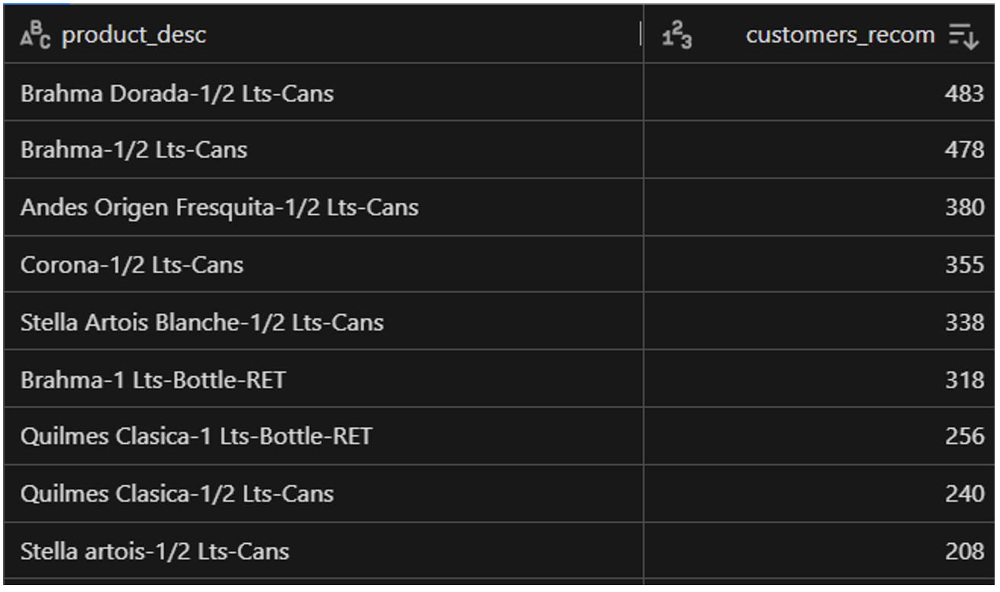
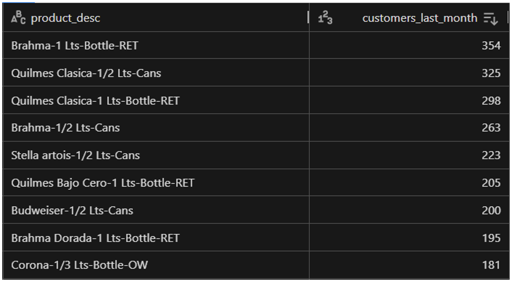
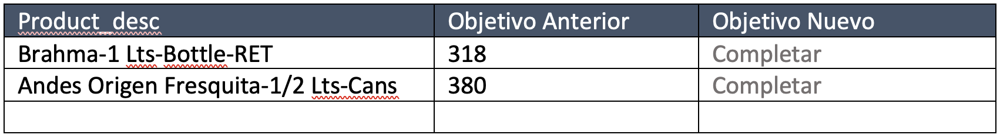

# Ejercicio – Data Scientist – Quilmes

El equipo de Data Science de Quilmes hizo un algoritmo de recomendación que genera para cada cliente, una lista de productos que debería comprar.
Ejemplo: Recomendaciones para un cliente

En base a las recomendaciones, se puede analizar a cuantos clientes en total será recomendado cada producto.

Ejemplo: Cantidad de clientes con recomendación por producto

Cada producto tiene atributos como segmento de precio (por ej. Premium), marca, etc, que se encuentran detallados en la tabla products.
 
El equipo de ventas revisó estos resultados y tiene algunos comentarios.
-	Hay productos que tienen demasiadas recomendaciones, y otros que tienen muy pocas. Como lineamiento, ningún producto debería tener más de 200% recomendaciones que compradores el último mes, y menos de 75%
-	El segmento premium debería tener al menos un 20% de las recomendaciones totales
-	El producto Brahma Dorada-1 Lts-Bottle-RET es foco de la compañía, por lo cual debería tener al menos 200 clientes con recomendación.

Ejemplo: Cantidad de clientes con compra por producto

En base a este feedback, el equipo de data science quiere calcular un nuevo objetivo para cada uno de los productos, cumpliendo con las restricciones de ventas, pero también tomando en cuenta los resultados del algoritmo. El número total de recomendaciones no puede ser modificado, pero si la distribución entre productos.

En esta etapa no se busca generar un nuevo algoritmo de recomendación, sino calcular un objetivo para cada uno de los productos. En una instancia posterior, el equipo utilizará este output para balancear las recomendaciones.

El resultado esperado es el siguiente:

Un nuevo objetivo calculado para cada producto:

Se espera que este nuevo objetivo sea definido a través de cálculos sobre el objetivo anterior, aumentando o disminuyendo los valores para cumplir con las restricciones. No es necesario aplicar algoritmos de optimización, aunque sí es posible si lo desean.

El entregable debe incluir:
-	Planteamiento del problema y la solución
-	Notebook en Python con la resolución
-	Tabla con los resultados a nivel producto con los nuevos objetivos calculados (csv o Excel)
-	Un informe para el área de ventas que incluya:
 - Evidencia que con los nuevos objetivos se cumplen las restricciones
 - Análisis de cuáles son los productos que quedan con mayor variación vs los resultados originales del algoritmo
 - Cantidad de recomendaciones por marca
-	Aclaración: en caso de que algún requerimiento sea ambiguo, tomar una asunción y aclararla en el entregable

